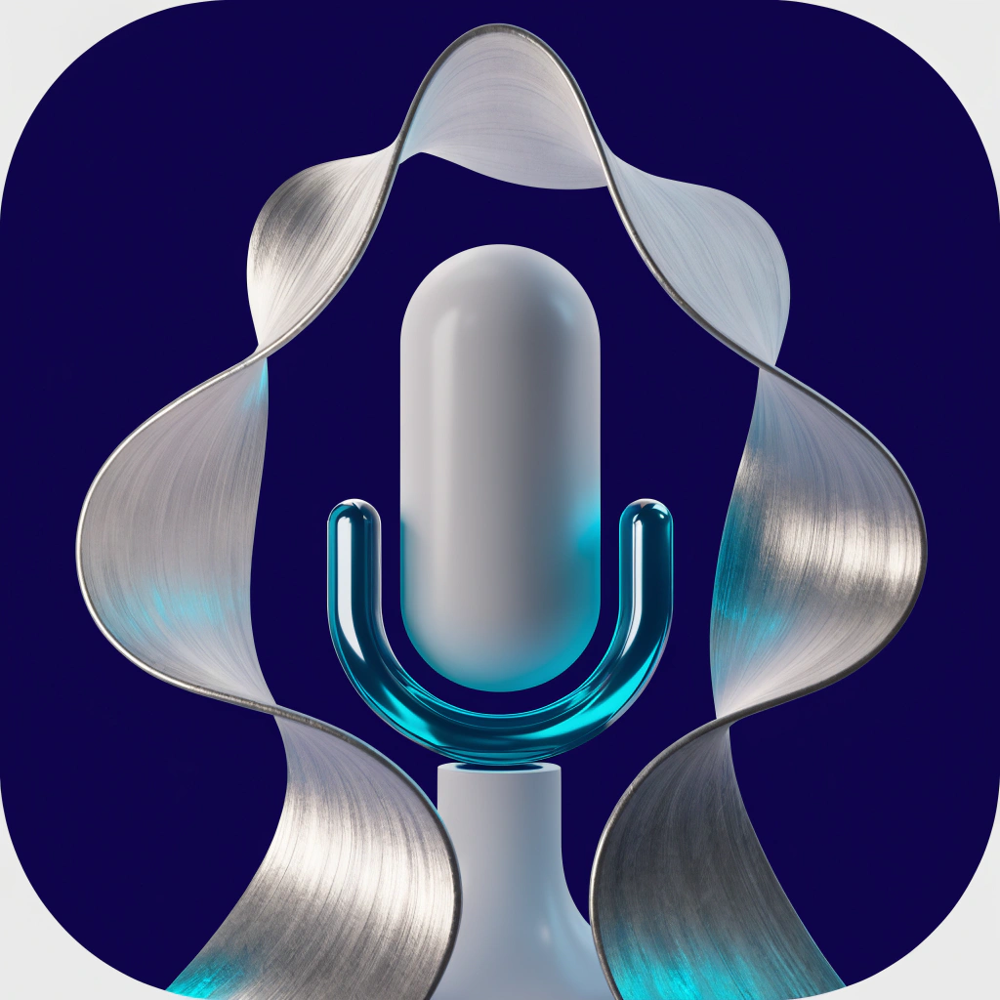
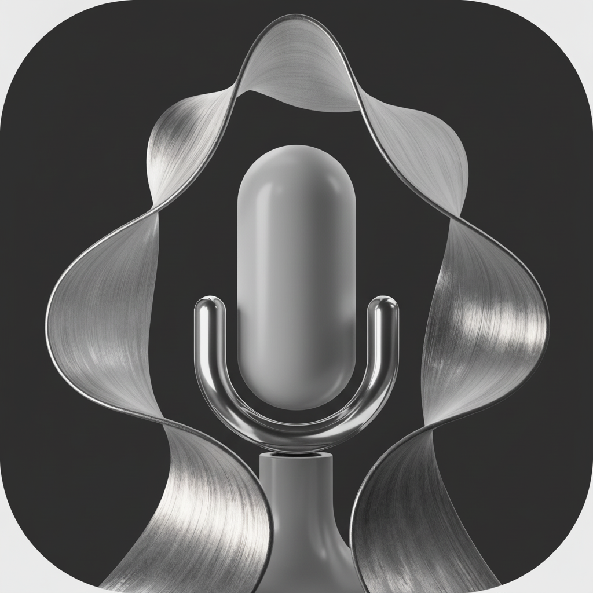
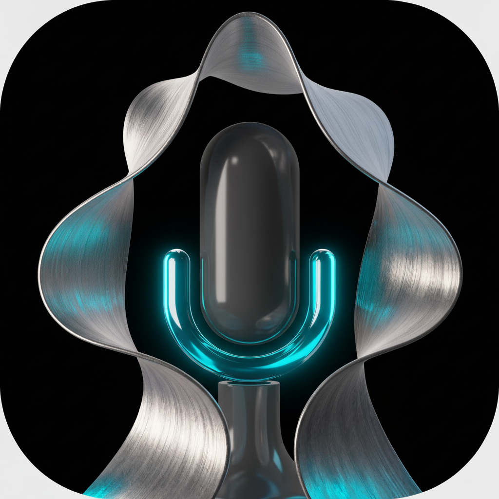

<p align="center">
  
</p>

<h1 align="center">VoiceInk</h1>

<p align="center">
  macOS menu bar push-to-talk voice input powered by <b>Qwen3-ASR</b> + <b>Qwen3-8B</b> on Apple Silicon.<br>
  Press right Option to talk, release to type. Everything runs locally.
</p>

<p align="center">
  
  
  
</p>

## Features

- **Push-to-talk** — hold right Option to record, release to transcribe and type
- **Toggle mode** — double-tap right Option for hands-free recording, tap again to stop
- **AI Text Polish** — Qwen3-8B post-processes transcriptions: converts spoken numbers to digits, math to symbols, removes filler words, adds punctuation — while preserving your bilingual code-switching
- **Screen context** — OCR captures visible screens, NER extracts proper nouns, feeds them as context to ASR for better accuracy
- **Custom dictionary** — add domain-specific terms for better recognition
- **Smart microphone management** — auto-detects device changes, remembers your preference
- **Bilingual support** — speak Chinese, English, or mix both freely — your language choices are preserved exactly
- **Native SF Symbol animations** — waveform icon with macOS-native effects
- **Transcription history** — last 30 transcriptions saved, click to copy
- **Auto-update** — checks GitHub for updates, one-click apply. Works with both git-clone and standalone installs.
- **Privacy first** — everything runs locally. No data leaves your Mac.

## Requirements

- Apple Silicon Mac (M1/M2/M3/M4)
- macOS 14+ (Sonoma or newer)
- Python 3.13 (`brew install python@3.13`)
- ffmpeg (`brew install ffmpeg`)
- ~8 GB disk space (ASR model ~3.4 GB + Text Polish model ~4.1 GB)
- 16 GB RAM recommended (both models loaded simultaneously)

## Install

### Option 1: Git Clone (recommended — enables fast updates)
```bash
git clone https://github.com/zw-g/VoiceInk.git
cd VoiceInk
chmod +x install.sh
./install.sh
```

### Option 2: Download ZIP (no git required)
1. Download from https://github.com/zw-g/VoiceInk/archive/refs/heads/main.zip
2. Unzip, then:
```bash
cd VoiceInk-main
chmod +x install.sh
./install.sh
```

Both methods work identically. Git-clone installs get faster updates via `git pull`; ZIP installs update via tarball download. VoiceInk auto-detects which method to use.

The install script will:
1. Create a Python virtual environment
2. Install all dependencies
3. Download ML models (Qwen3-ASR-1.7B + Qwen3-8B for text polish)
4. Compile the Swift NER tools
5. Set up the LaunchAgent
6. Copy VoiceInk.app to /Applications/

### Uninstall
```bash
~/.local/voice-input/uninstall.sh
```

## Usage

### Start
```bash
# Option 1: Click VoiceInk in /Applications/
# Option 2: From terminal
~/.local/voice-input/start.sh
```

### Controls
| Action | Key |
|---|---|
| Push-to-talk | Hold right Option, release to transcribe |
| Toggle recording | Double-tap right Option |
| Stop toggle recording | Tap right Option again |
| Cancel recording | Press Escape |

### Recording Modes

**Push-to-talk (hold):** Hold the hotkey while speaking. Release to transcribe. Supports long recordings up to 30 minutes.

**Toggle mode (double-tap):** Double-tap the hotkey to start recording hands-free. Tap once to stop and transcribe. Useful for long dictation sessions.

### Menu Bar
Click the waveform icon (top-right) to access:
- Recent Transcriptions (click to copy)
- Usage Statistics (today and all-time word/recording counts)
- Microphone selection
- Screen Context toggle
- Text Polish (AI) toggle
- Auto-Dictionary toggle
- Streaming Preview toggle
- Hotkey selection
- Edit Dictionary
- Check for Updates
- Auto-Update toggle
- Launch at Login
- Quit

### AI Text Polish

When enabled (on by default), transcriptions are post-processed by Qwen3-8B to:
- Convert spoken numbers to digits (百分之三十二 → 32%, thirty-eight → 38)
- Convert math expressions to symbols (大于 → >, 乘以 → ×, squared → ²)
- Remove filler words (呃, 嗯, um, uh, 就是说, 然后呢)
- Add proper punctuation
- Preserve idioms (三心二意, 不管三七二十一)
- **Preserve your language choices** — Chinese stays Chinese, English stays English

Toggle via menu bar: **Text Polish (AI)**

### Configuration

Edit `~/.local/voice-input/settings.json`:
```json
{
  "preferred_mic": "MacBook Pro Microphone",
  "screen_context": true,
  "text_polish": true,
  "auto_dictionary": true,
  "streaming": true,
  "hotkey": "alt_r",
  "auto_update": true,
  "model": "Qwen/Qwen3-ASR-1.7B",
  "ocr_languages": ["en", "zh-Hans", "zh-Hant"],
  "symbol": "waveform",
  "double_click_window": 0.35,
  "max_recording_secs": 1800,
  "stats": {"today": "", "today_words": 0, "today_recordings": 0, "total_words": 0, "total_recordings": 0}
}
```

| Setting | Description |
|---|---|
| `symbol` | Menu bar icon style: `"waveform"` (default), `"mic"`, or `"dot"` |
| `double_click_window` | Seconds between taps to trigger toggle mode (default `0.35`) |
| `max_recording_secs` | Maximum recording duration in seconds (default `1800` = 30 min) |

Hotkey options: `alt_r`, `alt_l`, `cmd_r`, `ctrl_r`, `f18`, `f19`, `f20`

### Custom Dictionary

Edit `~/.local/voice-input/dictionary.json`:
```json
{
  "vocabulary": ["Qwen", "MLX", "PyTorch", "Phabricator", "Claude"]
}
```
Changes auto-reload within 1 second.

VoiceInk automatically detects when you correct transcribed text. If the correction suggests a new term (brand names, technical terms, bilingual code-switching), a popup appears for 5 seconds to confirm the addition. Click the X button to cancel.

### Streaming Preview
See real-time transcription as you speak. A floating HUD at the bottom of the screen shows interim results during recording. Toggle on/off from the menu bar.

### Usage Statistics
Track your dictation usage locally. View today's and all-time word count and recording count from the Statistics submenu. All data is stored locally — never sent anywhere.

### Restart to Update

When auto-update downloads a new version in the background, a **Restart to Update** menu item appears in the menu bar. Click it to apply the update and restart VoiceInk.

## Permissions

On first launch, VoiceInk will check for required permissions:
- **Accessibility** — for keyboard monitoring + text pasting
- **Microphone** — for audio recording
- **Screen Recording** — for screen context OCR (optional)

## How It Works

```
Hold Option → Record audio → OCR screens → NER extracts proper nouns
                                            ↓
Release    → ASR transcribes with context → AI Text Polish → Type at cursor
```

1. Audio recorded via sounddevice (PortAudio)
2. All visible screens captured via CGWindowListCreateImage
3. Vision framework OCR extracts text
4. Apple NaturalLanguage NER extracts proper nouns and technical terms
5. Dictionary + NER terms passed as `context` to Qwen3-ASR decoder
6. Qwen3-8B post-processes: numbers → digits, fillers → removed, punctuation → added
7. Text inserted at cursor via AX API, CGEvent, or clipboard paste

## Architecture

- **ASR**: Qwen3-ASR 1.7B via [mlx-qwen3-asr](https://github.com/moona3k/mlx-qwen3-asr) (~3.4 GB)
- **Text Polish**: Qwen3-8B-MLX-4bit via [mlx-lm](https://github.com/ml-explore/mlx-lm) (~4.1 GB)
- **OCR**: Apple Vision framework (VNRecognizeTextRequest)
- **NER**: Apple NaturalLanguage framework (compiled Swift daemon)
- **UI**: rumps (NSStatusBar menu bar app)
- **Keyboard**: pynput (Quartz event tap)
- **Audio**: sounddevice (PortAudio)
- **Text insertion**: 3-tier hybrid (AX API → CGEvent → clipboard paste)

## System Requirements

- **CPU**: Apple Silicon (M1/M2/M3/M4) — required for MLX
- **macOS**: 14 (Sonoma) or newer
- **RAM**: 16 GB recommended (both models ~7.5 GB total)
- **Disk**: ~8 GB for ML models
- **Homebrew**: required for Python 3.13 and ffmpeg

## Troubleshooting

### Nothing happens when I press right Option
1. Check Accessibility permission: **System Settings > Privacy & Security > Accessibility**
2. Check the log: `tail -20 ~/.local/voice-input/voice_input.log`
3. The models may still be loading — wait for the "Ready" notification

### Text doesn't appear after recording
1. Check Accessibility permission (needed for text insertion)
2. Make sure the cursor is in a text field before recording
3. Try a longer recording (very short recordings < 0.3s are skipped)

### AI Text Polish not working
1. Check if Text Polish is enabled in the menu bar
2. The 8B model takes a few seconds to load on first use
3. Check the log for "Text polish model loaded" message

### Model download is slow
The install downloads ~7.5 GB of ML models. Check your internet connection. Models are cached in `~/.cache/huggingface/hub/` after first download.

### Screen context not working
Grant Screen Recording permission: **System Settings > Privacy & Security > Screen Recording**

### Wrong microphone selected
Click the menu bar icon > Microphone > select your preferred device. The preference is saved across restarts.

### App crashes or freezes
Check the log for errors:
```bash
tail -50 ~/.local/voice-input/voice_input.log
```
The app includes a watchdog that auto-recovers if the keyboard listener dies. It also auto-restarts on crashes via LaunchAgent KeepAlive.

## License

MIT
